# Tòpicos
- [Conceitos básicos de banco de dados relacionais](Conceitos-básicos-de-banco-de-dados-relacionais)
- [DML - Data Manipulation Language](DML---Data-Manipulation-Language)
- [Utilizar o mysql no terminal](Utilizar-o-mysql-no-terminal)

# Conceitos básicos de banco de dados relacionais

O nome SQL significa Structured Query Language — Linguagem Estruturada de Pesquisa. A SQL se tornou um padrão no mundo
dos ambientes de banco de dados relacionados. A linguagem SQL é um recurso muito utilizado por DBAs e desenvolvedores
para a execução de comandos em bancos de dados relacionais, e é por meio dela que criamos tabelas, colunas, índices,
atribuímos permissões a usuários, bem como realizamos consultas a dados, realizamos manutenção de transações e backups.

A linguagem SQL é dividida, então, em quatro grandes grupos de acordo com o tipo de operação a ser executada no banco de
dados. A saber, temos:

- **DML** (Data Manipulation Language, ou Linguagem de Manipulação de Dados em português).

- **DDL** (Data Definition Language, ou Linguagem de Definição de Dados em português).

- **DCL** (Data Control Language, ou Linguagem de Controle de Dados em português).

- **DTL** (Data Transaction Language, ou Linguagem de Transação de Dados em português).

- **DQL** (Data Query Language, ou Linguagem de Consulta de Dados em portuguêss), que tem apenas um comando (SELECT).

### Tipos de dados a serem armazenados nos atributos

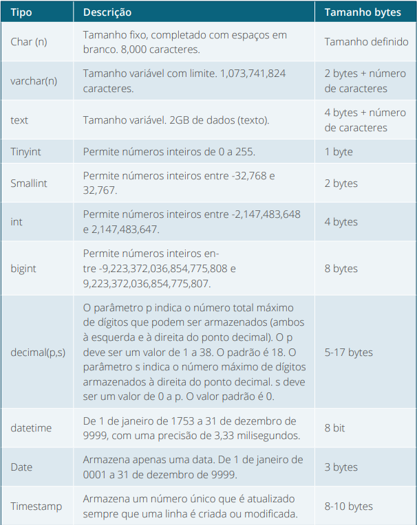

> Fonte: ALVES, F. Manipulação de dados entre PHP com as APIs (mysqli, mysqli prepared e pdo). In: ALVES, Programação back end II. 22.ed. Maringa, PR: Centro Universitário de Maringá, 2019. p. 142

# DDL - Data Definition Language

O **DDL** ou *Data Definition Language* (Linguagem de Definição de Dados)
permite ao desenvolvedor ou DBA (Database Administrator, em tradução: Administrador de Banco de Dados) definir as novas
tabelas e os elementos que serão associados a elas. É responsável pelos comandos de criação e alteração no banco de
dados, sendo composto por três comandos: **CREATE**, **ALTER** e **DROP**.

### Create table

Já o comando CREATE TABLE criará uma nova tabela. Os bancos de dados relacionais guardam seus dados dentro de tabelas
que são divididas em colunas. Cuidados ao escolher os nomes das tabelas, nomes de colunas e nomes de outros objetos do
banco de dados:

- O primeiro caractere deve ser alfabético (A–Z ou a–z).

- Após o primeiro caractere, pode-se utilizar números.

- Não são permitidos caracteres especiais.

- Apenas os seguintes caracteres não alfanuméricos são permitidos: # , $ e _.

```mysql
CREATE DATABASE unicesumarEad;
```

```mysql
CREATE TABLE usuario
(
    id             INT NOT NULL AUTO_INCREMENT primary key,
    nome           VARCHAR(255),
    email          VARCHAR(255),
    dataNascimento DATE,
    telefone       VARCHAR(20),
    dataCadastro   DATETIME
);
```

```mysql
CREATE TABLE usuario
(
    id             INT NOT NULL AUTO_INCREMENT primary key,
    nome           VARCHAR(255),
    email          VARCHAR(255),
    dataNascimento DATE,
    telefone       VARCHAR(20),
    dataCadastro   DATETIME
);
```

> Fonte: ALVES, F. Manipulação de dados entre PHP com as APIs (mysqli, mysqli prepared e pdo). In: ALVES, Programação back end II. 22.ed. Maringa, PR: Centro Universitário de Maringá, 2019. p. 144-145

### Alter Table

Adicionaremos (ADD) uma nova coluna à nossa tabela de usuário criada anteriormente. Esta nova coluna, “login”, será
criada após a nossa coluna “nome

```mysql
ALTER TABLE usuario
    ADD login char(15) AFTER nome;
```

Alterar (MODIFY) o tamanho de uma coluna. Por exemplo, alteraremos o campo de login, que está com tamanho 15, e o tipo
char para o tipo varchar com tamanho (20)

```mysql
ALTER TABLE usuario
    MODIFY login varchar(20);
```

Alterar (RENAME) o nome de uma coluna. Alteraremos o campo login para user

```mysql
ALTER TABLE usuario
    MODIFY user varchar(20);
```

Queremos excluir (DROP COLUMN) alguns campos. Excluiremos o campo de dataNascimento.

```mysql
ALTER TABLE CLIENTE
    DROP COLUMN dataNascimento;
```

O comando DROP é utilizado para a remoção de uma tabela ou do banco de dados por completo. Desta forma, para remover um
banco de dados por completo, basta inserirmos o seguinte comando:

```mysql
DROP DATABASE unicesumarEad;
```

Ou excluir uma tabela ao utilizar o seguinte comando:

```mysql
DROP TABLE usuario; 
```

Excluir só os dados de uma tabela
```mysql
TRUNCATE TABLE usuario;
```

> Fonte: ALVES, F. Manipulação de dados entre PHP com as APIs (mysqli, mysqli prepared e pdo). In: ALVES, Programação back end II. 22.ed. Maringa, PR: Centro Universitário de Maringá, 2019. p. 146


O comando ```DROP``` é extremamente perigoso, pois o mesmo exclui totalmente os dados. No caso de alguns SGBDs, não é
possível recuperar os dados, mas, em alguns, é possível aplicar o comando ```ROLLBACK```, desfazendo as transações.
Mesmo sabendo desta possibilidade, indicamos usar esse comando em último caso e em situações muito particulares.

# DML - Data Manipulation Language

Os comandos do subgrupo denominado DML (Data Manipulation Language ou Linguagem de Manipulação de Dados) têm como
objetivo recuperar dados
(realizar consultas), inserir novas linhas, alterar linhas existentes e remover linhas do banco de dados. Os comandos
que fazem parte desse subgrupo são: **SELECT**, **INSERT**, **UPDATE** e **DELETE**.

### Insert

O comando DML utilizado para inserir ou incluir novos dados em uma tabela ou visão é o INSERT. Para incluir uma nova
linha em uma tabela, além da palavra reservada INSERT, utilizamos a preposição (em inglês) **INTO**, o nome da tabela,
os nomes das colunas (que deverão ser declaradas entre parênteses e, dependendo da situação, podem ser opcionais), a
palavra **VALUES** e, finalizando, os valores que deverão ser incluídos (também entre parênteses). Voltando à tabela
usuario:

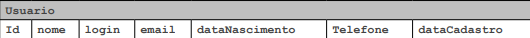

Digamos que os seguintes dados deverão ser inclusos na tabela usuário:

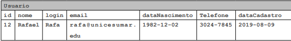

O comando a ser utilizado para incluir esses dados na tabela CLIENTE deverá ser o seguinte:

```mysql
INSERT INTO usuario (id, nome, login, email, dataNascimento,
                     telefone, dataCadastro)
VALUES (12, 'Rafael', 'rafa', 'rafael@
uniceumar.edu', 1982 - 12 - 02, '3024-7845', 2019 - 08 - 09);
```

Ou

```mysql
INSERT INTO usuario
VALUES (18, 'Arthur', 'arturo', 'arthur@
unicesumar.edu', 2007 - 12 - 02, '3487-4745', 2019 - 08 - 09);
```

Caso queira inserir mais de um registro de uma vez, após os parênteses do VALUES, coloque um vírgula e insira novos
registros dentro de parênteses. Vejamos um novo exemplo:

```mysql
INSERT INTO usuario (id, nome, login, email, dataNascimento,
                     telefone, dataCadastro)
VALUES (14, 'Carlos', 'carlos',
        'carlos@unicesumar.edu', 1982 - 12 - 02, '3024-7845', 2019 - 08 - 09),
       (21, 'Ricardo', 'rick', 'ricardo@unicesumar.edu', 1982 - 12 - 02,
        '3024-7845', 2019 - 08 - 09);
```

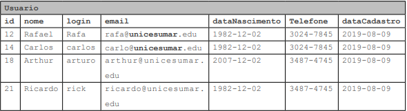

> Fonte: ALVES, F. Manipulação de dados entre PHP com as APIs (mysqli, mysqli prepared e pdo). In: ALVES, Programação back end II. 22.ed. Maringa, PR: Centro Universitário de Maringá, 2019. p. 147-148

### Delete

A exclusão de linhas de uma tabela é realizada por meio do comando **DELETE**. Podemos excluir uma ou mais linhas de uma
tabela ao utilizar esse comando.

Após a palavra reservada **DELETE**, utilizamos a preposição (em inglês)
**FROM**, que deverá ser seguida pelo nome da tabela. Quando desejamos excluir uma ou mais linhas, após a palavra **
WHERE** (
onde), devemos informar a condição para que a exclusão ocorra. Se a condição for verdadeira, a linha será excluída da
tabela. O exemplo a seguir apresenta a exclusão de uma linha
(do usuário, cujo id é igual a 12) da tabela usuario.

```mysql
DELETE
FROM usuario
WHERE id = 12;
```

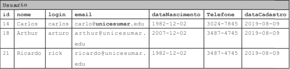

No entanto, tome cuidado: ao executar esse comando de forma errada, apagará todo o conteúdo da tabela.

```mysql
DELETE
FROM usuario;
```

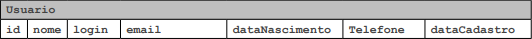

> Fonte: ALVES, F. Manipulação de dados entre PHP com as APIs (mysqli, mysqli prepared e pdo). In: ALVES, Programação back end II. 22.ed. Maringa, PR: Centro Universitário de Maringá, 2019. p. 147-150

### Update

Um banco de dados apresenta uma coleção de dados relacionados que, constantemente, passa por atualizações. Portanto,
quando precisamos atualizar os dados de uma tabela, utilizamos o comando **UPDATE**.

Quando utilizamos o comando **UPDATE**, devemos informar, na sequência, o nome da tabela que será seguido pela
palavra **SET** e do nome da coluna em que ocorrerá a alteração ou atualização dos dados. A seguir, será preciso
informar qual será o novo valor e, muito importante, em qual linha a atualização deverá ser realizada. Utilizamos como
referência, para identificar a linha a ser atualizada, a chave primária, pois, assim, sempre teremos certeza de
atualizar a linha correta. Vamos alterar o telefone do registro do usuario 18.

```mysql
UPDATE usuario
SET telefone = '3028-9711'
WHERE id = 18;
```

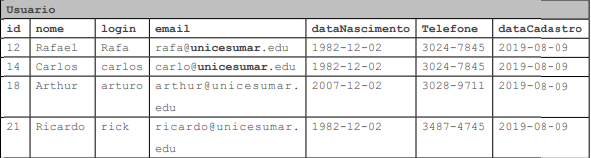

De forma análoga ao comando **DELETE**, o **UPDATE** permite alterar todos os registros de um campo específico. Para
isso, deve-se omitir a cláusula **WHERE**. Veja, a seguir, como ficou:

```mysql
UPDATE usuario
SET telefone = '3028-9711';
```

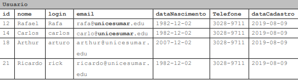

> Fonte: ALVES, F. Manipulação de dados entre PHP com as APIs (mysqli, mysqli prepared e pdo). In: ALVES, Programação back end II. 22.ed. Maringa, PR: Centro Universitário de Maringá, 2019. p. 150-151

### Select

O comando **SELECT** é utilizado para a realização de consultas em tabelas ou visões. Por meio das consultas, podemos
obter todos os dados de uma tabela ou apenas aqueles que desejamos, utilizando, para isso, filtros. Veja, a seguir, como
realizar uma consulta para obter todos os registros da tabela usuario.

```mysql
SELECT *
FROM usuario;
```

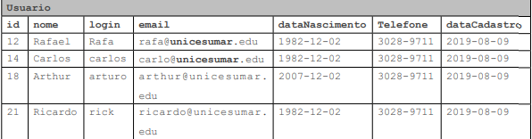

Agora, para obter os nomes dos usuários, utilizando, para isso, a tabela usuario.

```mysql
SELECT nome
FROM usuario;
```

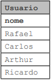

Agora, se desejarmos buscar algum valor em específico, utilizaremos a cláusula **WHERE**. A cláusula **WHERE** é a
responsável por filtrar resultados, utilizando parâmetros comparativos como igual, diferente, maior, menor e entre
outros. Além disso, podemos usar diversos filtros em nossas consultas, inclusive, adicionar parênteses para priorizar
consultas dentro de escopos. A cláusula **WHERE** funciona da seguinte forma:

```mysql
SELECT coluna, coluna
FROM nome_da_tabela
WHERE condicao_ da_consulta;
```

```mysql
SELECT *
FROM usuario
WHERE id = 12;
```

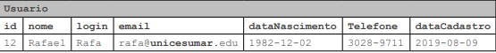

> Fonte: ALVES, F. Manipulação de dados entre PHP com as APIs (mysqli, mysqli prepared e pdo). In: ALVES, Programação back end II. 22.ed. Maringa, PR: Centro Universitário de Maringá, 2019. p. 151-152

# Utilizar o mysql no terminal

Primeiramente devemos logar no mysql, digite o comando

```bash
mysql -h localhost -u root -p
```
- mysql      -- evocamos o servidor

- -h         -- dizemos que o próximo dado é referente ao host

- localhost  -- informamos o o host

- -u         -- dizemos que o próximo dado é referente ao usuário

- root       -- informamos o usuário

- -p         -- dizemos que o próximo dado é referente a senha


Verificar os bancos de dados existentes no ambiente
```bash
SHOW DATABASES;
```

Por padrão todo os servidor mysql vem com os seguintes bancos de dados:

- information_schema
- mysql
- performance_schema

Verificar qual banco de dados está aberto no momento
```bash
status;
```

Abrir ou usar um banco de dados

```bash
use {nome-do-banco};
```

Verificar as tabelas abertas no banco de dados atualmente
```bash
show tables;
```

Verifica qual foi o comando que foi utilizado pra criar essa tabela
```bash
show create table {nome-da-tabela};
```

Verifica qual foi o comando que foi utilizado pra criar esse banco de dados
```bash
show create database {nome-do-banco-de-dados};
```
Mostrar a estrutura de uma tabela específica, com seus campos, tipos, null(yes/no), key, default e extra
```bash
describe {nome-da-tabela};
```

ou

```bash
desc {nome-da-tabela};
```

Verificar os gafanhotos cadastrados

```bash
select * from {nome-da-tabela};
select * from gafanhotos;
```

Renomear o curso de PHP para P

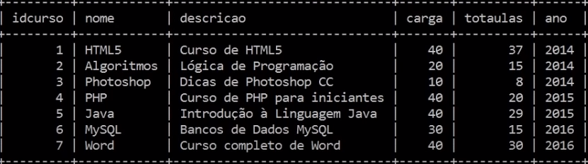
```bash
update {nome-da-tabela} set {campo} = {valor} where {campoId} = {valor};

update cursos set nome = 'Ph' where idcurso = '4';
```

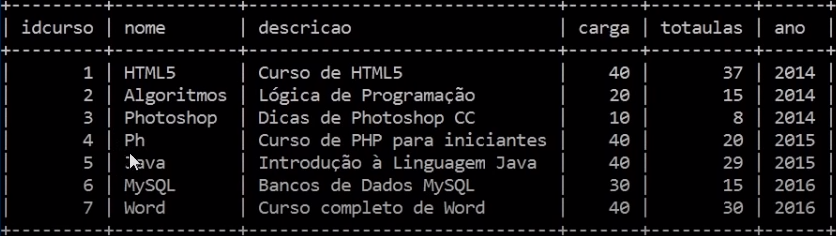

Padrão de colection recomendado: utf8-general-ci
