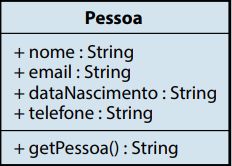
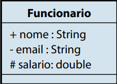
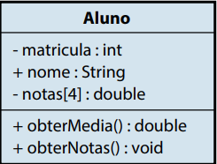
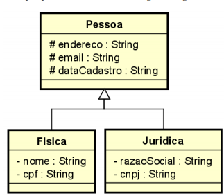
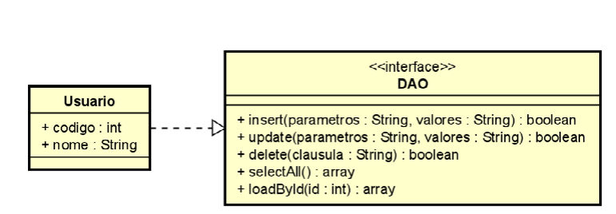
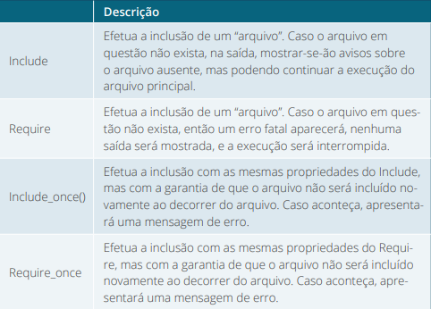
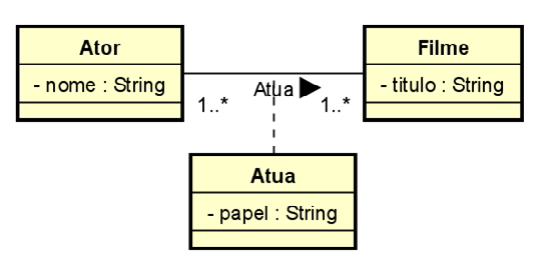
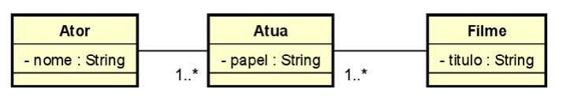

# Tópicos

- [O que é Programação Orientada a Objetos](#O-que-é-Programação-Orientada-a-Objetos)
- [Classes](#Classes)
- [Atributo](#Atributo)
- [Objeto](#Objeto)
- [Métodos](#Métodos)
- [Modificadores de acesso PUBLIC, PRIVATE e PROTECTED](#Modificadores-de-acesso-PUBLIC,-PRIVATE-e-PROTECTED)
- [Encapsulamento](#Encapsulamento)
- [Entendendo a diferença dos modificadores Static, Abstract e Final](#Entendendo-a-diferença-dos-modificadores-Static,-Abstract-e-Final)
- [Herança e Classes Abstratas](#Herança-e-Classes-Abstratas)
- [Classes Abstratas](#Classes-Abstratas)
- [Polimorfismo](#Polimorfismo)
- [Interfaces-e-Componentes](#Interfaces-e-Componentes)
- [PSRs](#PSRs)


# O que é Programação Orientada a Objetos

# Paradigma

Para Bezerra (2007), o termo paradigma pode ser compreendido como um
modelo ou padrão a ser seguido para a resolução de um problema. No desenvolvimento de software, não existe uma receita de bolo – você, com a sua expertise
e o seu raciocínio lógico, construirá uma solução adequada para cada problema.

 > Fonte: ALVES, F. Programação Orientada a Objetos. In: Bezzera, 2007 **Programação back end II**. 22.ed. Maringa, PR: Centro Universiário de Maringá, 2019. p. 12

Na visão de Dall’Oglio (2009, p. 86), o termo paradigma “representa toda
uma filosofia para a construção de sistemas”, buscando, assim, retratar a visão do
mundo real como um sistema de objetos cooperativos e colaborativos. O mundo
que o autor cita realmente é o mundo real, onde temos objetos que possuem uma
forma, mas com características e comportamentos diferentes.

 > Fonte: ALVES, F. Programação Orientada a Objetos. In: DALL’OGLIO, 2009 **Programação back end II**. 22.ed. Maringa, PR: Centro Universiário de Maringá, 2019. p. 12

### Abordagem Estrutural

O desenvolvimento de software com a abordagem estrutural consiste na construção de um sistema sequencial. Assim, os programas são criados baseados em
quais funções, procedimentos e variáveis são necessárias para resolver um problema. Esse paradigma possui uma estrutura básica com instruções, decisões e interações de forma sequencial. Nessa forma de programar, é possível ainda criar funções/
módulo, ou seja, a divisão do programa em módulos menores (YOURDON, 1990). 

 > Fonte: ALVES, F. Programação Orientada a Objetos. In: YOURDON, 1990 **Programação back end II**. 22.ed. Maringa, PR: Centro Universiário de Maringá, 2019. p. 13

Além de programar em módulo, a abordagem estrutural permite a reutilização de código, ou seja, não é necessário escrever os códigos dessas funções todas
as vezes que for necessário, bastando apenas chamá-los para serem executados
novamente. Mesmo assim, ainda obedece a ordem sequencial lógica do programa,
ou seja, uma instrução após a outra.

 > Fonte: ALVES, F. Programação Orientada a Objetos. In: ALVES, F. **Programação back end II**. 22.ed. Maringa, PR: Centro Universiário de Maringá, 2019. p. 13

### Abordagem Orientada a Objetos

Já o desenvolvimento de software com a abordagem orientada a objetos consiste
na construção de módulos independentes ou objetos que podem ser facilmente
substituídos, modificados e reutilizados. O programador deve conseguir abstrair do problema coisas que podem ser representadas como objetos, como, por
exemplo: se deseja criar um programa para saber se um candidato está ou não
aprovado em um concurso, o programa deverá criar objetos para representar o
candidato e o concurso.

 > Fonte: ALVES, F. Programação Orientada a Objetos. In: ALVES, F. **Programação back end II**. 22.ed. Maringa, PR: Centro Universiário de Maringá, 2019. p. 13

A Orientação a Objetos tem, como principal característica, a forma natural
de tratar a realidade, pois considera que o mundo real é formado por objetos. Os
objetos são definidos em classes – forma com características e comportamentos –,
em que cada objeto criado é denominado de instância (SOMMERVILLE, 2011).

 > Fonte: ALVES, F. Programação Orientada a Objetos. In: SOMMERVILLE, 2011. **Programação back end II**. 22.ed. Maringa, PR: Centro Universiário de Maringá, 2019. p. 13

A Orientação a Objetos é um estilo de programação que permite aos desenvolvedores agruparem tarefas semelhantes em classes. Passamos a visualizar classes
como responsáveis por atributos contidos nelas, com operações criadas para
tratá-los, e a execução das atividades contidas nas classes dos sistemas passam a
depender da interação dessas classes (SOMMERVILLE, 2011).

 > Fonte: ALVES, F. Programação Orientada a Objetos. In: SOMMERVILLE, 2011. **Programação back end II**. 22.ed. Maringa, PR: Centro Universiário de Maringá, 2019. p. 14

# Classes

A classe é uma estrutura que definirá um tipo de dado, podendo conter atributos
e, também, métodos para manipular os atributos da classe. Uma classe representa
a abstração de um conjunto de objetos do mundo real que possui comportamentos e características comuns.

 > Fonte: ALVES, F. Programação Orientada a Objetos. In: DALL’OGLIO, 2009 **Programação back end II**. 22.ed. Maringa, PR: Centro Universiário de Maringá, 2019. p. 15

Podemos exemplificar uma classe como um conjunto de características de um
ser humano, por exemplo: gênero, peso, altura, nome, e-mail, data de nascimento
etc. Essas características se transformam em atributos da classe ou variáveis de
classe. A classe é um modelo para criação dos objetos de um mesmo domínio, ou
seja, cada classe é responsável por um assunto diferente e possui responsabilidade
sobre si mesmo por meio de métodos.

 > Fonte: ALVES, F. Programação Orientada a Objetos. In: ALVES, F. 2009 **Programação back end II**. 22.ed. Maringa, PR: Centro Universiário de Maringá, 2019. p. 15

 

  > Fonte: ALVES, F. Programação Orientada a Objetos. In: ALVES, F. 2009 **Programação back end II**. 22.ed. Maringa, PR: Centro Universiário de Maringá, 2019. p. 16

```php
class NomeDaClasse
{
//instruções;
}
  ```

# Atributo

Atributo é uma característica ou propriedade particular que os objetos de uma
classe possuem, assumindo valores diferentes para cada objeto. Para declarar
um atributo, colocaremos um identificador precedido da visibilidade (public,
private e protected) do atributo.

  > Fonte: ALVES, F. Programação Orientada a Objetos. In: ALVES, F. 2009 **Programação back end II**. 22.ed. Maringa, PR: Centro Universiário de Maringá, 2019. p. 16

```php
class NomeDaClasse
{
public $identificador;
}
  ```

A identificação da visibilidade dos atributos em um diagrama UML é informado por meio
de um símbolo.

**Public**: é visível de qualquer lugar do sistema. No diagrama de classes, é identificado pelo
símbolo “+”.

**Private**: é visível apenas de dentro da classe. Não pode ser acessado de fora da classe. No
diagrama de classes, é identificado pelo símbolo “-“.

**Protected**: é visível de dentro da classe e das subclasses herdadas dessa classe, mas não
de fora. No diagrama de classes, é identificado pelo símbolo “#”.

 > Fonte: ALVES, F. Programação Orientada a Objetos. In: ALVES, F. 2009 **Programação back end II**. 22.ed. Maringa, PR: Centro Universiário de Maringá, 2019. p. 16

 # Objeto

Para Dall’Oglio (2009, p. 93), “um objeto é uma estrutura dinâmica originada com base em uma classe”. Isso significa que um objeto é dinâmico, ou seja,
ele pode sofrer alterações no decorrer do seu curso de vida. O objeto é único e
possui comportamentos e características próprios. Ele é fruto de uma instância
de uma classe (BEZERRA, 2007).

Ainda de acordo Dall’Oglio (2009, p. 93), “o objeto é uma instância de uma
classe, porque o objeto existe durante dado instante de tempo – da sua criação
até a sua destruição”. Analisando este conceito, temos que um objeto é único
no sistema, ou seja, durante a sua vida, ele possui uma referência de memória,
garantindo a ele uma unicidade no sistema.

 > Fonte: ALVES, F. Programação Orientada a Objetos. In: ALVES, F. 2009 **Programação back end II**. 22.ed. Maringa, PR: Centro Universiário de Maringá, 2019. p. 18

Para instanciar um objeto, primeiro, criaremos uma variável que receberá
a instância da classe. Para instanciar uma classe, é utilizado o operador new,
seguido do nome da classe, com abre e fecha parênteses

```php
$objeto = new NomeDaClasse();
```

No exemplo a seguir, fazemos o uso da classe Pessoa, criando um objeto ($pessoa). Para termos o acesso aos atributos da classe, utilizaremos o nome do atributo
precedido pelo nome do objeto.

# Métodos

De acordo com Dall’Oglio (2009), um método é considerado um comportamento ou uma funcionalidade específica e única de uma classe. Isso significa que o
método deve ser único, ou seja, deve possuir apenas uma única funcionalidade. É
por esse motivo que os métodos são considerados de responsabilidades das classes. O método da classe em PHP segue os mesmos princípios de uma function,
apenas possui, no início de sua declaração, a visibilidade do método. Confira a
sintaxe a seguir:

```php
public function nomeFuncao()
{
//instruções
//
}
```
 > Fonte: ALVES, F. Programação Orientada a Objetos. In: ALVES, F. 2009 **Programação back end II**. 22.ed. Maringa, PR: Centro Universiário de Maringá, 2019. p. 20

### Método Construtor

O método construtor é um método especial, executado na instância da classe
pelo operador new, e esse método não produz um valor de retorno, pois estará retornando o próprio objeto. Todavia, o desenvolvedor pode implementar,
em suas classes, o método construtor, e ele será chamado a cada objeto recém-criado. É adequado para qualquer inicialização que o objeto necessite
antes de ser utilizado

 > Fonte: ALVES, F. Programação Orientada a Objetos. In: ALVES, F. 2009 **Programação back end II**. 22.ed. Maringa, PR: Centro Universiário de Maringá, 2019. p. 23

Para criar uma instância de uma classe, a instrução new deve ser utilizada. Um objeto sempre será criado exceto se a classe tiver um construtor definido que dispare uma exceção
em caso de erro. Classes devem ser definidas antes de instanciadas – e, em alguns casos,
isso é obrigatório.

Se uma string, contendo o nome da classe, é utilizada com new, uma nova instância da
classe será criada

```php
<?php
$instance = new SimpleClass();
// Também pode ser feito com uma variável:
$className = 'SimpleClass';
$instance = new $className(); // new SimpleClass()
?>
```
> Fonte: PHP ([2020], on-line)

Para declarar o método construtor em uma classe, seguiremos a sintaxe a seguir.

```php
function __construct()
{
//instruções
}
```

### Método destrutor

O método destrutor é um outro método especial executado automaticamente
quando o objeto é desalocado da memória. Esse processo pode ocorrer de forma
natural, ou seja, quando terminar as chamadas do objeto à classe ou quando forçamos o PHP a liberar a referência do objeto pelo comando apresentado a seguir.
Para implementar o método destrutor, siga a sintaxe a seguir:

```php

function __destruct()
{
//instrução
}

```

 > Fonte: ALVES, F. Programação Orientada a Objetos. In: ALVES, F. 2009 **Programação back end II**. 22.ed. Maringa, PR: Centro Universiário de Maringá, 2019. p. 26

 # Modificadores de acesso PUBLIC, PRIVATE e PROTECTED

 
 > Fonte: ALVES, F. Programação Orientada a Objetos. In: ALVES, F. 2009 **Programação back end II**. 22.ed. Maringa, PR: Centro Universiário de Maringá, 2019. p. 28

 
  > Fonte: ALVES, F. Programação Orientada a Objetos. In: ALVES, F. 2009 **Programação back end II**. 22.ed. Maringa, PR: Centro Universiário de Maringá, 2019. p. 33
  
 Até aqui, trabalhamos com a visibilidade **public** [notação UML (**+**)] dos atributos
e métodos. Este é o nível de acesso mais permissivo, pois ele indica que o método
ou atributo da classe é público, ou seja, pode ser acessado em qualquer outro ponto do código e por outras classes. Contudo, ainda temos mais duas visibilidades
(private e protected). Com essas visibilidades, definimos se o atributo ou método
pode ou não ser acessado fora da classe em que foi declarado.

A visibilidade **private** [notação UML (**-**)] significa que membros declarados
com essa visibilidade só podem ser acessados de dentro da própria classe em que
foram declarados. Desta forma, os membros não podem ser acessados de fora
da classe em que eles estão contidos.

A visibilidade **protected** [notação UML (**#**)] significa que membros declarados com essa visibilidade só podem ser acessados pela
própria classe ou classes filhas da
classe principal

 > Fonte: ALVES, F. Programação Orientada a Objetos. In: ALVES, F. 2009 **Programação back end II**. 22.ed. Maringa, PR: Centro Universiário de Maringá, 2019. p. 28

 Para modificar a visibilidade de um atributo ou método, devemos proceder sua
declaração de uma das palavras reservadas que representam o modificador para
o atributo e método da seguinte forma:

```php
modificador $atributo;
modificador function metodo()
{
//instruções
}
```

Para que seja possível acessar os atributos private e protected, necessitamos de
métodos públicos, conhecidos como modificadores de acesso **setters** e **getters**,
que setam e resgatam valores, respectivamente.

```php
modificador function setNomeDaVariavel(<parâmetro>)
{
$this-><atributo> = <parâmetro>;
}
```

O método **setter** recebe, por parâmetro, o valor a ser armazenado no atributo
da classe.

```php
modificador function getNomeDaVariavel()
{
return $this-><atributo>;
}
```

Os modificadores de acesso são de extrema importância em um projeto, pois estão ligados diretamente a critérios de segurança e pontos de acesso ao código. Tais
princípios estão ligados, também, a boas práticas em desenvolvimento

# Encapsulamento

O encapsulamento é um mecanismo
que provê proteção de acesso aos membros internos de um objeto

 > Fonte: ALVES, F. Pilares da Programação Orientada a Objetos. In: Dall’Oglio (2009, p. 107) **Programação back end II**. 22.ed. Maringa, PR: Centro Universiário de Maringá, 2019. p. 28

Proteger meus atributos significa
proteger meus dados, e proteger seus comportamentos ocultando o que pode ser
realizado, deixando visível apenas para quem tem acesso.

Para o autor Bezerra (2007), toda a comunicação entre objetos e classes se dá
pela troca de mensagem entre objeto remetente, que solicita a execução de alguma
operação ou valor, e objeto destinatário, que os devolve ao objeto remetente por meio
da mensagem.

### Como restringir atributos e métodos?

Uma forma de restringi-los é utilizando as visibilidades public, private e
protected. A visibilidade define a forma como essas propriedades devem ser
acessadas de forma externa. 

### como acessar esses atributos ou métodos?

Os atributos que possuem a visibilidade public podem ser acessadas por todos os objetos externos de forma direta, isso é um risco para a sua aplicação.
Os atributos que possuem a visibilidade private só podem ser acessados
internamente à classe, e, para serem acessados de forma externa, é necessário
utilizar um método que possua a visibilidade public.
Os atributos que possuem a visibilidade protected só podem ser acessados
internamente à classe ou em classes que dela herdam, e, da mesma forma que
a visibilidade private, para serem acessados de forma externa, é necessário
utilizar um método que possua a visibilidade public.
Normalmente, esses métodos são chamados de métodos acessores, que
vão setar ou resgatar o valor do atributo.

# Entendendo a diferença dos modificadores Static, Abstract e Final

O **modificador Static** é usado para definir que um método ou atributo em uma classe é estático. Nesse caso, o valor estático pertence à classe e não às instâncias,
mas podem ser usados dentro da classe via ```self```. Isso é muito interessante para valores que devem ficar disponíveis para toda a aplicação, ou seja, valores constantes. Podemos acessá-las fora da classe, e, neste caso, basta colocar o nome da
classe seguido de **::** e o nome do atributo ou método.

O **modificador Final** previne que classes filhas possam sobrescrever um
método da superclasse que esteja marcada com o operador final. Se a própria
classe estiver definida como final, ela também não pode ser estendida, ou seja,
ela não pode ser superclasse (DALL’OGLIO, 2009).

Confiram a sintaxe do php:

```php
<?php
  class Teste1{
    final public function metodo(){}
  }
?>

<?php
    final class teste
    {

    }
?>
```

O **modificador Abstract** nada mais é do que um método que consiste na definição de uma assinatura na *classe abstrata.* Neste caso, a assinatura do método
terá um (**;**) no seu fim. Esse método deverá ter a sua implementação realizada na
classe que a estender. 

Confiram a sintaxe do php:

```php
abstract class Teste1{
  abstract public function metodo1();
  public function metodo2(){
    //instruções
  }
}
```

# Herança e Classes Abstratas

Segundo Bezerra (2007, p. 11), “a **generalização** pode ser vista como um nível de abstração acima da encontrada entre classes e objetos. Na generalização, classes
semelhantes são agrupadas em uma hierarquia”

De acordo com Dall’Oglio (2009, p. 98),

> [...] a utilização da herança a objetos e do encapsulamento do código em classes nos orienta em direção a uma maior organização, mas um dos maiores benefícios que encontramos na utilização desse paradigma é o reuso.

Resumindo, a herança se utiliza de uma classe denominada classe filha, que tem os mesmos atributos e responsabilidades de outra classe chamada de classe mãe
ou classe pai e os seus próprios atributos e responsabilidades. As classes inferiores da hierarquia, automaticamente, herdam todas as propriedades e os métodos das classes superiores, chamadas de superclasses, confira a figura a seguir


Confira a sintaxe a seguir

```php
class SuperClasse{
}
----------------------------------------
class Filho1 extends SuperClasse{
}
----------------------------------------
class Filho2 extends SuperClasse{
}
----------------------------------------
class FilhodeFilho1 extends Filho1{
}
```

### Exemplo de Herança



# Classes Abstratas

As classes definidas como abstratas não podem ser
instanciadas, e qualquer classe que contenha, ao menos, um método abstrato também deve ser abstrata. Contudo, se temos uma classe que não pode ser instanciada, o que pode ser feito com ela? Só podemos entendê-la.

Uma classe abstrata serve como estrutura ou modelo para outras classes, por esse motivo, utilizamos ela com a herança. Dessa forma, marcaremos a classe super como abstract, e o interpretador do php não permitirá que se instancie um objeto de uma classe marcada com abstract. 

Sintaxe:

```php
abstract class Pessoa
{
 /*
 #####################################
 conteúdo já escrito no exemplo anterior
 - declaração dos atributos
 - método construtor e setters
 #####################################
 */

 abstract public function exibirDados();
?>
```
# Polimorfismo

Para Dall’Oglio (2009, p. 101), ele define polimorfismo como: 

Polimorfismo em orientação a objetos é o princípio que permite que
classes derivadas de uma mesma superclasse tenham métodos iguais
(com a mesma nomenclatura e parâmetros), mas comportamentos
diferentes, redefinidos em cada uma das classes-filhas.

Para Bezerra (2007, p. 11), “polimorfismo indica a capacidade de abstrair várias implementações diferentes em uma única interface”.

Resumindo, um método de uma classe herdeira que possui a mesma assinatura
pode fazer a operação da superclasse e mais alguma instrução própria.
Neste caso, utilizaremos o comando ```parent::``` seguido do nome do método

# Interfaces e Componentes

### Interface

A interface é um recurso de POO muito utilizado pelos desenvolvedores de sistemas, principalmente, quando se necessita trabalhar com uma grande equipe
de desenvolvedores e manter uma estrutura concisa e coesa. Dessa forma, temos
que, na etapa de projeto, você pode definir conjuntos de métodos que determinadas classes do nosso sistema deverão implementar incondicionalmente. Uma
interface possui apenas **assinatura de métodos**, ou seja, métodos prototipados,
e não possuem atributos, por isso, compreende-se como um contrato que o desenvolvedor assina com o projetista.

Interfaces de objetos permitem a criação de códigos que especificam quais
métodos uma classe deve implementar, sem definir como esses métodos serão
tratados. Interfaces são definidas da mesma forma que classes, mas com a palavra-chave *interface* substituindo class e com nenhum dos métodos tendo
seu conteúdo definido. Todos os métodos declarados em uma interface **devem ser públicos**, essa é a natureza de uma interface.

Para implementar uma interface, o operador *implements* é utilizado. Todos os métodos na interface devem ser implementados na classe; não fazê-lo resultará em um erro fatal. As classes podem implementar mais de uma interface se assim for desejado, separando cada interface com uma vírgula.

#### Exemplo



### Componentes

Um componente é, basicamente, um elemento que encapsulará uma série de
funcionalidades. Esse componente pode ser facilmente encaixado ao ser incorporado à programação, podemos associá-lo a uma “peça” com funções específicas,
combináveis e reusáveis. Um componente é uma **unidade independente**, ou seja,
não teria dependência de outras classes ou componentes para ser executado,
sendo possível ser incorporado a qualquer momento e a outros componentes
para formar um sistema mais complexo.

O uso de componentes de software possibilita **encapsular complexidades** técnicas e multidisciplinares, e o desenvolvedor não precisa conhecer os detalhes do funcionamento interno dos componentes para montar os sistemas.
O baixo grau de acoplamento entre componentes e as interfaces bem definidas favorecem o **desenvolvimento distribuído** e a alocação de diferentes
desenvolvedores para partes específicas do sistema, o que é desejável porque
dificilmente uma única pessoa detém o conhecimento para desenvolver todo
um sistema colaborativo (GEROSA; STEINMACHER, 2011).

Geralmente, um componente de software é um módulo preparado para **reusar suas funcionalidades** prontas e testado em múltiplos sistemas e contextos, o
que favorece a redução do tempo de desenvolvimento e o aumento da qualidade do sistema. Podemos associar um componente ao uso de uma biblioteca, em
vez de criar uma classe, é possível simplesmente incluir esse componente com o
código já criado para fazer o que se deseja.

#### Funções e inclusão de componentes



Utilizamos classes associativas quando ocorrem associações entre duas classes
que possuem multiplicidade muitos (*) em ambas as extremidades. Essa classe
é necessária para armazenar atributos transmitidos pela associação de ambas as
classes, o que não impede que a classe associativa possua atributos próprios, ou
seja, armazena os atributos transmitidos pela associação.

De acordo com Sommerville (2011), quando uma associação possui atributos próprios, pode-se criar uma classe associativa. Essas classes são úteis quando
queremos armazenar o histórico de uma associação (relacionamentos que ocorrem e interessam ser salvos).

A associação é representada por uma
reta tracejada partindo
do meio da associação
até uma classe.

#### Exemplo



No modelo da figura, podemos observar que a multiplicidade em ambos os
lados da associação é “*” (várias), o que implica dizer que, em um filme, podem
haver vários atores, e um ator pode atuar em diversos filmes. Como resultado
dessa associação, temos uma classe associativa que permite armazenar cada uma
das atuações, juntamente com o papel, em uma classe separada.

As classes associativas podem ser substituídas por classes normais, chamadas **Classes Intermediárias**, conforme o exemplo abaixo




# PSRs

### PSR4 configuração básica

Editar o arquivo **composer.json**
```json
{
    "require": {
        "squizlabs/php_codesniffer": "3.*",
        "friendsofphp/php-cs-fixer": "^3.1"
    },
    "name": "renanvt/teste",
    "description": "Mais um projeto PHP",
    "type": "project",
    "license": "MIT",
    "minimum-stability": "dev",
    "autoload": {
        "psr-4": {
            "App\\": "src/"
        }
    }
}
```

Editar o arquivo **index.php** na pasta **public**

```php
require dirname(path: __DIR__) . '/vendor/autoload.php';
```

OBS:
- As classes devem estar dentro da pasta **src/{namespace}**
- A pasta **src** será a pasta de Sources Root

### PSR-4 Configuração avançada

https://github.com/Renanvt/dev-back-end-II/tree/main/Configuracao

